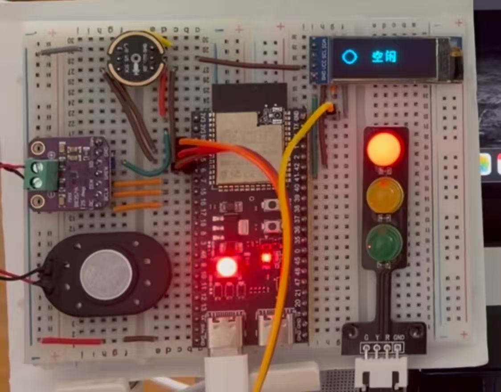

# Claude Light

[English](README.en.md)

Claude Light 是一个适用于 **Claude Code** 和 **Codex CLI** 的 macOS 工作状态灯。

它可以同时驱动：

- macOS 桌面上的悬浮红绿灯
- 通过 BLE 连接的 ESP32-S3 板载 RGB 灯
- 后续接入 ESP32 GPIO 的实体红绿灯

## 项目演示

本视频演示了系统的主要功能流程，包括登录、数据展示、业务操作和结果查看。

[](./assets/show-video.mp4)

<video src="./assets/show-video.mp4" controls width="800"></video>

## 状态含义

| 状态值 | 显示效果 | 含义 |
| --- | --- | --- |
| `idle` | 红灯常亮 | 当前空闲，或本轮任务已经完成 |
| `thinking` | 黄灯慢呼吸 | Agent 正在思考、生成回复或处理工具结果 |
| `awaiting_confirmation` | 黄灯快闪 | Agent 正在等待用户授权 |
| `working` | 绿灯慢呼吸 | Agent 正在调用工具、执行命令或读写文件 |
| `error` | 红灯快闪或橙红灯 | 任务异常结束或状态文件无法解析 |

## 工作原理

```text
Claude Code / Codex CLI Hooks
              |
              v
      bin/claude-light-state
              |
              v
    ~/.claude-light/state.json
              |
              v
       Claude Light macOS App
         |                |
         v                v
  桌面悬浮红绿灯      CoreBluetooth BLE
                           |
                           v
                       ESP32-S3 RGB
```

Hooks 只负责写入本地 JSON 状态文件。macOS App 监听状态文件、刷新悬浮灯，并通过 BLE 自动连接 ESP32-S3。

ESP32 固件烧录完成后只需要 USB 供电，不需要通过 USB 连接 Mac。Mac 与 ESP32 之间通过 BLE 通信。

## 环境要求

### 仅使用 macOS 悬浮灯

- macOS 13 或更高版本
- Xcode Command Line Tools 或 Xcode
- Swift 6 兼容工具链
- Claude Code 或 Codex CLI

检查 Swift：

```sh
swift --version
```

### 使用 ESP32-S3 板载 RGB 灯

- ESP32-S3 开发板
- Arduino IDE
- Arduino IDE 中安装 `esp32 by Espressif Systems`
- 一根用于首次烧录的 USB 数据线
- 后续供电使用的 USB 电源、充电器、充电宝或 Mac USB 接口

## 安装 macOS App

克隆项目：

```sh
git clone https://github.com/thebigboy/claude-light.git
cd claude-light
```

开发模式运行：

```sh
swift run claude-light
```

构建标准 macOS App：

```sh
scripts/build-app.sh
```

构建产物位于：

```text
dist/Claude Light.app
```

推荐安装到 `/Applications`：

```sh
cp -R "dist/Claude Light.app" "/Applications/Claude Light.app"
open "/Applications/Claude Light.app"
```

首次启动时，macOS 可能请求蓝牙权限。需要选择允许，否则 App 无法连接 ESP32。

如果 macOS 阻止打开 App，可前往：

```text
系统设置 → 隐私与安全性 → 安全性 → 仍要打开
```

## 配置 Mac 开机自动启动

安装 App 到 `/Applications` 后，打开：

```text
系统设置 → 通用 → 登录项与扩展 → 登录时打开
```

添加：

```text
/Applications/Claude Light.app
```

完成后，Mac 重启时 App 会自动启动、监听状态文件并重新连接 ESP32。

## 烧录 ESP32-S3 固件

Arduino 固件位于：

```text
firmware/claude-light-esp32/claude-light-esp32.ino
```

在 Arduino IDE 中：

1. 打开 `claude-light-esp32.ino`。
2. 选择 `工具 → 开发板 → esp32 → ESP32S3 Dev Module`。
3. 建议设置 `USB CDC On Boot: Enabled`。
4. 选择正确串口并上传。
5. 打开串口监视器，将波特率设置为 `115200`。

启动成功后应看到：

```text
ClaudeLight BLE ready
Device: ClaudeLight
Service: 7d6c1000-7a93-4b8b-9d55-4b31f058a501
State characteristic: 7d6c1001-7a93-4b8b-9d55-4b31f058a501
```

ESP32 会广播名为 `ClaudeLight` 的 BLE 设备。手机系统蓝牙页面不一定显示普通 BLE 设备，需要使用 `nRF Connect` 或 `LightBlue` 扫描。

固件烧录成功后无需重复烧录。ESP32 只要接通 USB 电源就会自动启动，Mac App 会自动扫描、连接并在断线后重连。

## 配置 Claude Code Hooks

示例配置：

```text
examples/claude-code-settings.json
```

Claude Code 支持以下配置位置：

- 全局生效：`~/.claude/settings.json`
- 项目级配置：`.claude/settings.json`
- 仅本机项目配置：`.claude/settings.local.json`

全局配置步骤：

```sh
mkdir -p ~/.claude
open -e ~/.claude/settings.json
```

如果还没有 Claude Code 配置，可以从示例开始：

```sh
cp examples/claude-code-settings.json ~/.claude/settings.json
```

如果配置文件已经存在，只合并示例中的 `hooks` 对象，不要覆盖原有配置。

### Claude Code 状态映射

| Claude Code 事件 | 灯状态 |
| --- | --- |
| `UserPromptSubmit` | `thinking` |
| `PreToolUse` | `working` |
| `PostToolBatch` | `thinking` |
| `PermissionRequest` | `awaiting_confirmation` |
| `Notification: permission_prompt` | `awaiting_confirmation` |
| `Stop` | `idle` |
| `StopFailure` | `error` |

配置完成后，在 Claude Code 中运行 `/hooks`，确认配置已经加载。

## 配置 Codex CLI Hooks

Codex CLI 原生支持生命周期 Hooks。推荐使用全局配置，让所有项目都能驱动状态灯。

示例配置：

```text
examples/codex-hooks.json
```

复制为全局 Hooks 配置：

```sh
cp examples/codex-hooks.json ~/.codex/hooks.json
```

如果 `~/.codex/hooks.json` 已存在，只合并示例中的 `hooks` 对象，不要直接覆盖。

Codex Hooks 默认启用。也可以在 `~/.codex/config.toml` 中显式启用：

```toml
[features]
hooks = true
```

### Codex CLI 状态映射

| Codex CLI 事件 | 灯状态 |
| --- | --- |
| `UserPromptSubmit` | `thinking` |
| `PreToolUse` | `working` |
| `PostToolUse` | `thinking` |
| `PermissionRequest` | `awaiting_confirmation` |
| `Stop` | `idle` |

Codex CLI 当前没有对应 Claude Code `StopFailure` 的稳定 Hook，因此异常结束不一定能自动显示 `error`。

配置完成后：

1. 重新启动 Codex CLI。
2. 在 Codex CLI 中运行 `/hooks`。
3. 检查 Hook 来源并信任新增 Hooks。

Codex 会根据 Hook 内容哈希记录信任状态。修改 Hook 命令后，需要再次通过 `/hooks` 审核。

## 修改 Hooks 中的项目绝对路径

Claude Code 和 Codex CLI 示例配置使用：

```sh
/Users/wangzhen/code/ai/claude-light/bin/claude-light-state <state>
```

如果项目位于其他目录，必须替换所有 Hook 命令中的路径。

例如项目位于：

```text
/Users/alice/dev/claude-light
```

对应命令应为：

```sh
/Users/alice/dev/claude-light/bin/claude-light-state <state>
```

可以在项目目录执行：

```sh
pwd
```

然后将输出路径拼接 `/bin/claude-light-state`。

## 手动测试

确保 Claude Light App 正在运行，然后执行：

```sh
bin/claude-light-state idle
bin/claude-light-state thinking
bin/claude-light-state awaiting_confirmation
bin/claude-light-state working
bin/claude-light-state error
```

状态文件位于：

```text
~/.claude-light/state.json
```

示例：

```json
{
  "state": "working",
  "updated_at": "2026-05-27T02:00:25Z",
  "session_id": "",
  "cwd": "",
  "hook_event_name": ""
}
```

## Mac 重启后的日常使用

如果 Claude Light App 已加入登录项：

1. 给 ESP32 接通 USB 电源。
2. 启动 Mac。
3. Claude Light App 自动启动。
4. App 自动通过 BLE 连接 ESP32。
5. 正常使用 Claude Code 或 Codex CLI。

不需要重新烧录 ESP32，也不需要让 ESP32 通过 USB 连接 Mac。

如果没有配置登录项，每次 Mac 重启后手动打开：

```sh
open "/Applications/Claude Light.app"
```

## 多会话行为

Claude Code、Codex CLI 和多个并行会话共用：

```text
~/.claude-light/state.json
```

最后触发 Hook 的会话决定当前灯色。例如 Codex 正在工作时，另一个 Claude Code 会话结束并写入 `idle`，灯会切换为红色。

## 常见问题

### 手动执行脚本后灯没有变化

检查状态文件：

```sh
cat ~/.claude-light/state.json
```

确认 App 正在运行：

```sh
pgrep -fl claude-light
```

### ESP32 没有跟随状态变化

1. 确认 macOS 已允许 Claude Light 使用蓝牙。
2. 确认 ESP32 已供电。
3. 重启 Claude Light App。
4. 使用 `nRF Connect` 或 `LightBlue` 确认能扫描到 `ClaudeLight`。
5. 如果 ESP32 使用外置天线版本，确认已连接 2.4 GHz IPEX/U.FL 天线。

### Claude Code Hooks 没有触发

在 Claude Code 中运行 `/hooks`，并确认 Hook 命令中的绝对路径正确。

### Codex CLI Hooks 没有触发

在 Codex CLI 中运行 `/hooks`，检查并信任 Hooks。确认 `~/.codex/hooks.json` 格式正确，并确认没有在 `~/.codex/config.toml` 中设置：

```toml
[features]
hooks = false
```

### App 启动后终端出现 IMK 日志

macOS InputMethodKit 日志通常可以忽略，只要悬浮灯和 ESP32 状态能够正常变化即可。

## 参考资料

- [Codex Hooks 官方文档](https://developers.openai.com/codex/hooks)
- [Codex Hooks 配置位置](https://developers.openai.com/codex/config-advanced#hooks)
- [JasonLam08/cursor_agent_status_light](https://github.com/JasonLam08/cursor_agent_status_light)

## 许可证

MIT
